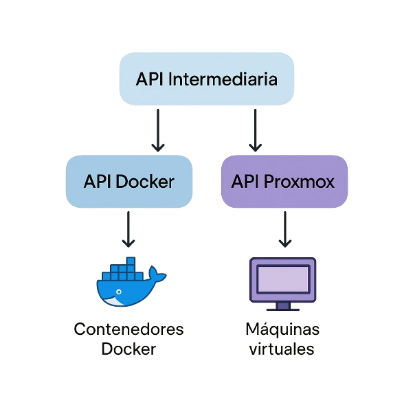

# Resumen Del Proyecto

## Índice de Contenidos

1. [Visión General](#visión-general)
2. [Introducción](#introducción)
   - [Objetivo del Proyecto](#objetivo-del-proyecto)
   - [Problemática Abordada](#problemática-abordada)
3. [Tecnología Base](#tecnología-base)
4. [Arquitectura del Sistema](#arquitectura-del-sistema)
5. [Estructura de APIs](#estructura-de-apis)
6. [Flujo de Funcionamiento](#flujo-de-funcionamiento)
7. [Consideraciones Técnicas](#consideraciones-técnicas)
8. [Distribución del Trabajo](#distribución-del-trabajo)

## Visión General

Sistema de plataforma web que permite el despliegue automatizado de servicios a través de contenedores y máquinas virtuales, ofreciendo una experiencia unificada y simplificada para usuarios técnicos y no técnicos.

## Introducción

### Objetivo del Proyecto

Desarrollar una plataforma automatizada que permita a usuarios solicitar y recibir entornos de desarrollo y producción completamente funcionales en cuestión de minutos, eliminando barreras técnicas y reduciendo significativamente los tiempos de provisión de infraestructura.

### Problemática Abordada

El proceso tradicional de configuración de servidores presenta múltiples inconvenientes:
- Requiere intervención manual en múltiples etapas
- Implica largos tiempos de espera para disponibilidad de recursos
- Exige conocimientos técnicos avanzados en sistemas y redes
- Presenta alta probabilidad de errores humanos durante la configuración

## Tecnología Base

### Proxmox VE

| Característica | Descripción |
|---------------|-------------|
| **Licencia** | GNU AGPLv3 (código abierto) |
| **Capacidades principales** | Hipervisor KVM para máquinas virtuales, gestión de contenedores LXC |
| **Interfaces** | API REST completa, interfaz web, CLI |
| **Ventajas clave** | Consolidación de recursos, alta disponibilidad, gestión centralizada |

### Docker Engine

| Característica | Descripción |
|---------------|-------------|
| **Licencia** | Apache License 2.0 (código abierto) |
| **Capacidades principales** | Contenedores ligeros y portables, aislamiento efectivo |
| **Interfaces** | Docker CLI, API REST, SDK para diversos lenguajes |
| **Ventajas clave** | Despliegue rápido y consistente, eficiencia en recursos |

## Arquitectura del Sistema

La infraestructura se organiza en capas con separación clara de responsabilidades:



### Componentes Principales

- **API Intermediaria**: Actúa como punto central de coordinación y orquestación
  - Gestiona solicitudes del frontend
  - Dirige peticiones al servicio correspondiente
  - Mantiene estado global del sistema

- **API Docker**: Componente especializado para gestión de contenedores
  - Interfaz directa con Docker Engine
  - Proporciona funcionalidades de creación, configuración y monitoreo
  - Optimiza el uso de recursos para aplicaciones ligeras

- **API Proxmox**: Componente para administración de virtualización
  - Interfaz con el hipervisor Proxmox VE
  - Gestiona el ciclo de vida completo de máquinas virtuales
  - Proporciona acceso a funciones avanzadas de virtualización

**Ejemplo de estructura de petición:**

```json
{
"user_id": "12345",
"username": "usuario_ejemplo",
"service_type": "docker", // o "vm"
"service_format": "web", // u otros servicios
"storage_gb": 10,
"ram_mb": 512,
"additional_requirements": {}
}
```

## Flujo de Funcionamiento

### 1. Solicitud Inicial del Usuario

- El usuario accede a la interfaz web de la plataforma
- Selecciona la opción "Crear Servicio Web" 
- Completa el formulario con especificaciones:
  - Nombre del servicio
  - Archivos a publicar (HTML, CSS, JS)
  - Recursos necesarios (almacenamiento, RAM)
  - Configuraciones adicionales

### 2. Procesamiento Frontend

- Validación de entrada en cliente
- Generación de petición con formato JSON estructurado
- Envío a través de API RESTful

### 3. API Intermediaria (Orquestador)

- Validación estructural y semántica de la petición
- Clasificación de solicitud (tipo "web" en contenedor Docker)
- Preparación de datos para API Docker
- Generación de identificador único
- Registro en logs y base de datos

### 4. API Docker (Despliegue)

- Utilización de Docker SDK para Python
- Selección de imagen base apropiada (ej: `httpd` para Apache)
- Creación de Dockerfile temporal con configuraciones
- Almacenamiento de archivos del usuario
- Construcción de imagen personalizada
- Despliegue del contenedor con límites de recursos

### 5. Gestión de Red y DNS

- Asignación dinámica de puerto y dirección IP interna
- Actualización de configuración Nginx (proxy inverso)
- Creación de virtual host específico para el servicio
- Actualización del sistema DNS interno para nuevo subdominio
- Establecimiento de reglas de red y firewall

### 6. Certificados SSL

| Aspecto | Implementación |
|---------|----------------|
| **Sistema** | Let's Encrypt a través de Caddy |
| **Validación** | DNS-01 para verificación robusta de dominios |
| **Cobertura** | Dominio principal y todos los subdominios generados |
| **Renovación** | Automática con verificación preventiva |
| **Configuración** | HTTPS obligatorio con HTTP/2 habilitado |

### 7. Base de Datos y Gestión

- Registro de metadatos del servicio en base de datos relacional
- Almacenamiento de información crítica:
  - ID único del servicio
  - Usuario propietario
  - Tipo y configuración
  - Recursos asignados
  - Estado actual
  - Timestamps de creación y modificación

### 8. Respuesta al Usuario

- Frontend recibe y procesa respuesta JSON
- Visualización de información clave:
  - URL del servicio (`usuario-ejemplo.dominio.com`)
  - Estado actual (activo/iniciando)
  - Credenciales de acceso (si aplica)
  - Panel de administración y monitoreo

### 9. Acceso del Usuario Final

- Usuario accede a `usuario-ejemplo.dominio.com`
- Sistema DNS resuelve al servidor Nginx
- Nginx redirige tráfico al contenedor correspondiente
- Contenedor sirve contenido web con optimizaciones

## Consideraciones Técnicas

### Gestión de Enlaces e Identificadores

La asociación entre usuarios y recursos activos presenta los siguientes desafíos:

- **Identificación**: Generación de IDs únicos con alta entropía
- **Persistencia**: Almacenamiento dual en frontend (localStorage) y backend (BD)
- **Arquitectura de datos**: Evaluación entre:
  - Base de datos compartida con alta disponibilidad
  - Sistemas sincronizados con replicación
  - Servicio dedicado de gestión de identidad

### Seguridad y Aislamiento

- Separación estricta entre servicios de diferentes usuarios
- Límites de recursos por contenedor/VM
- Monitoreo continuo de actividad sospechosa
- Actualización automática de componentes críticos

## Distribución del Trabajo

### Infraestructura Física y Redes

| Responsabilidades | Objetivos |
|-------------------|-----------|
| Configuración de red local y acceso remoto | Preparación completa del entorno físico |
| Gestión de conectividad entre servicios | Optimización del flujo de datos |
| Administración de recursos (espacio, RAM, CPU) | Maximizar eficiencia y disponibilidad |

### Docker & Dockerfiles

| Responsabilidades | Objetivos |
|-------------------|-----------|
| Desarrollo de imágenes personalizadas | Diseño y prueba de Dockerfiles optimizados |
| Optimización de capas y volúmenes | Reducir tamaño y mejorar rendimiento |
| Documentación técnica detallada | Facilitar mantenimiento y escalamiento |

### APIs y Microservicios

| Responsabilidades | Objetivos |
|-------------------|-----------|
| Investigación de endpoints relevantes | Implementar APIs robustas y bien documentadas |
| Diseño de sistema para interacción entre componentes | Garantizar interoperabilidad |
| Pruebas exhaustivas y documentación | Asegurar confiabilidad del sistema |

### Documentación y Presentación

| Responsabilidades | Objetivos |
|-------------------|-----------|
| Redacción de guías técnicas | Documentar proceso completo |
| Diseño de esquemas arquitectónicos | Clarificar relaciones entre componentes |
| Preparación de material de presentación | Comunicar efectivamente la propuesta |
